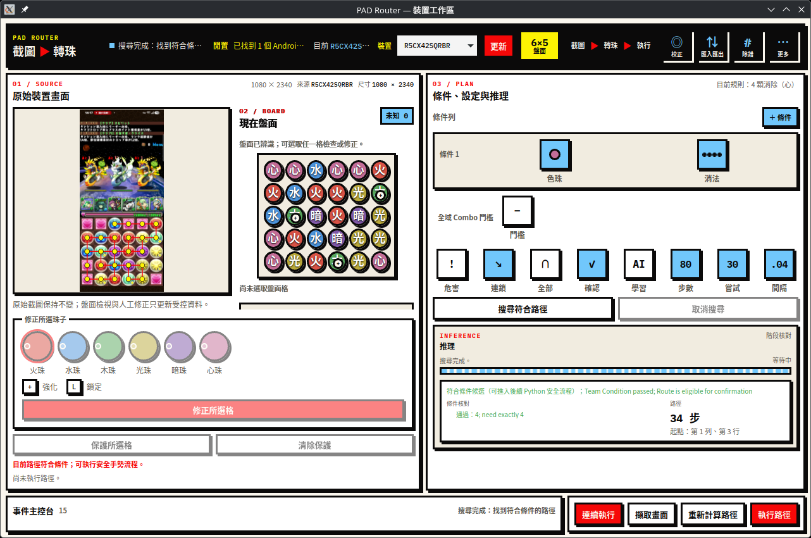
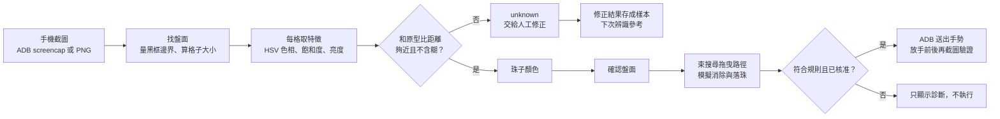
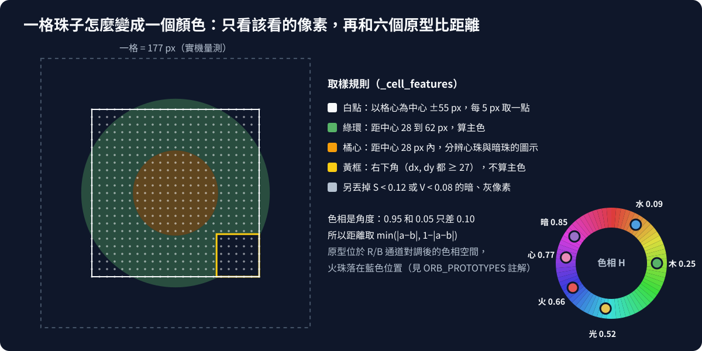
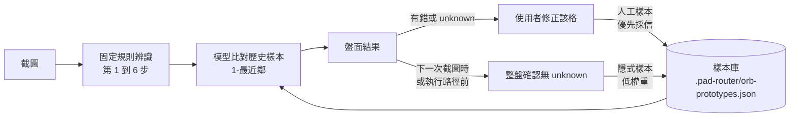
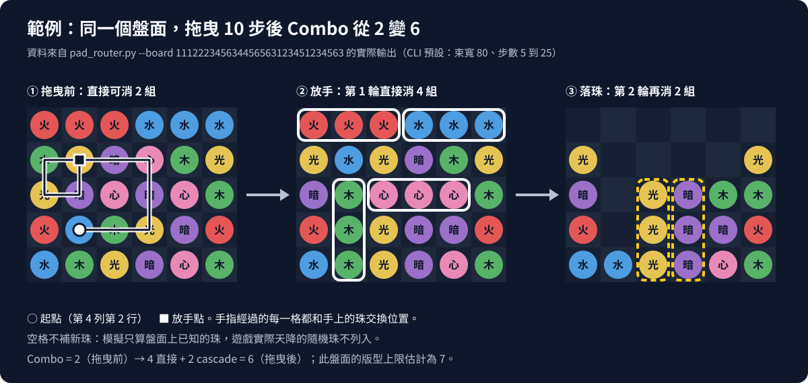
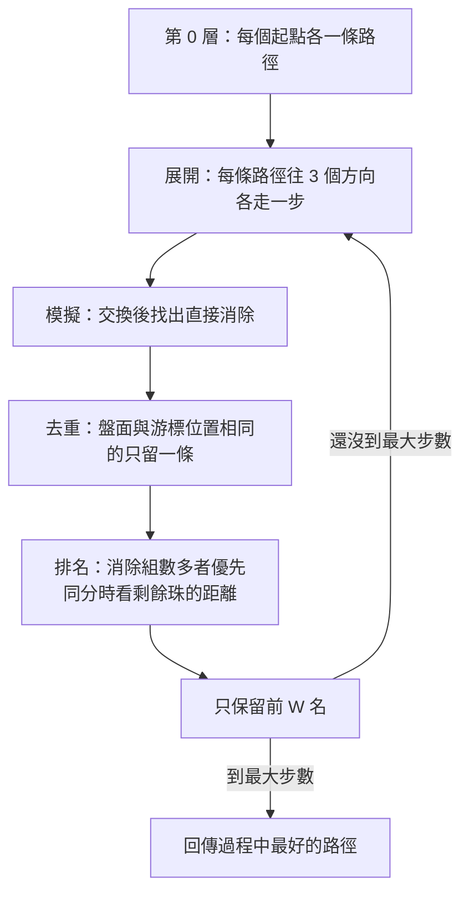
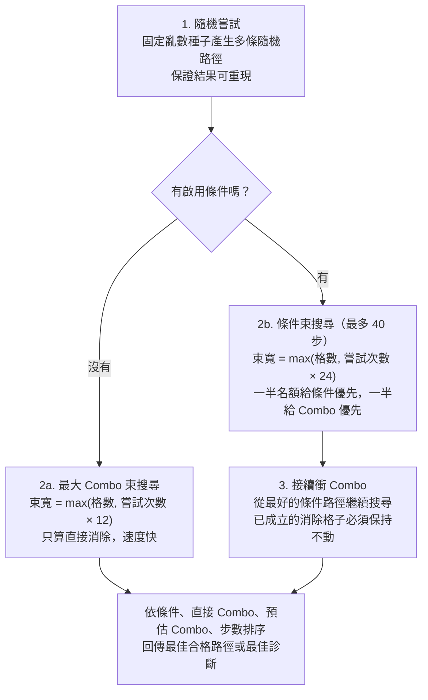

# PAD Router｜以轉珠遊戲為例的影像辨識與路徑搜尋

**這個 repo 以轉珠遊戲《龍族拼圖》為例**，示範一套完整的小型電腦視覺與搜尋流程：從手機截圖找出盤面，把每一格辨識成珠子顏色，再搜尋一條能消除最多組（Combo）或符合條件的拖曳路徑。辨識與搜尋只用 Python 標準函式庫，沒有 OpenCV、不需要訓練神經網路；辨識會從人工修正中累積樣本，越用越準，每一步的判斷都能用數字解釋。

> **非官方專案。** 《龍族拼圖》（Puzzle & Dragons）是 GungHo Online Entertainment 的作品與商標，本專案與其無關。截圖中的遊戲畫面版權屬原權利人。透過 ADB 自動操作遊戲可能違反遊戲服務條款，本 repo 的目的是研究影像辨識與搜尋演算法，實際使用的風險由使用者自行判斷。



上圖是 2026-09-17 以 SM-A1560 實機截圖執行的畫面：辨識出 30 格、0 格未知，規則設為「消除 4 顆心珠」，搜尋找到一條 34 步的合格路徑，並畫回原始截圖上。

## 目錄

- [整體流程](#整體流程)
- [快速開始](#快速開始)
- [第一部分：電腦怎麼看懂盤面](#第一部分電腦怎麼看懂盤面)
  - [AI 模型學習：辨識怎麼越用越準](#7-ai-模型學習辨識怎麼越用越準)
- [第二部分：轉珠路徑怎麼找](#第二部分轉珠路徑怎麼找)
- [安全執行與驗證](#安全執行與驗證)
- [限制](#限制)
- [延伸文件](#延伸文件)

## 整體流程



程式分三層：[`pad_router.py`](pad_router.py) 是辨識、規則與搜尋核心；[`pad_router_gui.py`](pad_router_gui.py) 管理截圖、校正、人工修正與學習樣本；[`webview/`](webview/) 是離線桌面介面。完整責任邊界見[架構與資料流](docs/reference/architecture.md)。

## 快速開始

需要 Python 3.10 以上與 [`uv`](https://docs.astral.sh/uv/)。桌面介面使用 `pywebview==5.4` 的 Linux GTK/WebKit backend，Ubuntu 第一次使用前安裝：

```bash
sudo apt-get update
sudo apt-get install --yes python3-gi gir1.2-gtk-3.0 gir1.2-webkit2-4.1
uv venv --system-site-packages --allow-existing
uv sync
```

不需要手機也能先看搜尋結果。`--board` 以 30 個數字由左到右、由上到下描述盤面（1 火、2 水、3 木、4 光、5 暗、6 心）：

```bash
uv run python pad_router.py --board 111222345634456563123451234563
```

```text
Detected board:
火 火 火 水 水 水
木 光 暗 心 木 光
光 暗 心 暗 心 木
火 水 木 光 暗 火
水 木 光 暗 心 木
Classes: dark x5, fire x5, heart x4, light x5, water x5, wood x6
Combos: 6; score: 5992.0; steps: 10
Path: (4,2) -> (4,3) -> (4,4) -> (3,4) -> (2,4) -> (2,3) -> (2,2) -> (2,1) -> (3,1) -> (3,2) -> (2,2)
Dry run. Add --play to send this gesture.
```

路徑座標是「(列, 行)」，從 1 開始。CLI 預設只試算（dry run），加上 `--play` 才會透過 ADB 操作手機。

```bash
# 桌面介面：截圖、校正、修正、規則、搜尋、執行
uv run python pad_router.py --gui

# 不需裝置的自我檢查與完整測試
uv run python pad_router.py --self-check
uv run python -m unittest
```

介面操作步驟見[使用指南](docs/guides/user-guide.md)。

## 第一部分：電腦怎麼看懂盤面

一張手機截圖對電腦來說只是 1080×2340 個像素，每個像素是紅、綠、藍（RGB）三個 0 到 255 的數字。「辨識」就是把這一大堆數字，逐步縮減成 30 個答案：這格是什麼珠。

OpenCV 這類影像函式庫提供的，正是這條路上的通用工具：色彩空間轉換、門檻切割、找輪廓、取感興趣區域（ROI）、樣板比對。本專案沒有安裝 OpenCV，而是用標準函式庫實作同樣的概念；下文每一步都會對照 OpenCV 中對應的做法，方便把原理搬到其他專案。

### 1. 換一個色彩空間：RGB 轉 HSV

RGB 的三個數字會同時受「顏色」和「光線」影響：同一顆紅珠在反光處與陰影處，RGB 可以差很多。HSV 把顏色拆成三個比較獨立的量：

- **H 色相**：是哪一種顏色（紅、黃、綠、藍……），以圓上的角度表示。
- **S 飽和度**：顏色有多鮮豔，灰色接近 0。
- **V 亮度**：有多亮，黑色接近 0。

反光、陰影主要改變 S 與 V，H 相對穩定，所以辨識主要看 H。設 $R, G, B \in [0, 1]$，$M = \max(R,G,B)$，$m = \min(R,G,B)$，$C = M - m$：

$$
V = M,\qquad
S = \begin{cases} C / M & M > 0 \\ 0 & M = 0 \end{cases},\qquad
H = \frac{1}{6}\times\begin{cases}
\dfrac{G - B}{C} \bmod 6 & M = R \\[4pt]
\dfrac{B - R}{C} + 2 & M = G \\[4pt]
\dfrac{R - G}{C} + 4 & M = B
\end{cases}
$$

本專案用 Python 的 `colorsys.rgb_to_hsv`，三個值都落在 0 到 1。OpenCV 的 `cv2.cvtColor(img, cv2.COLOR_BGR2HSV)` 做同一件事，但 8 位元影像的 H 範圍是 0 到 179，而且 OpenCV 預設讀進來的通道順序是 **BGR** 而不是 RGB。

通道順序是真實會踩到的坑。Android `screencap` 給的是 RGBA 位元組，而 [`_cell_features`](pad_router.py#L1594) 讀取時把紅、藍通道對調後才算色相，所以程式裡的六個顏色原型（[`ORB_PROTOTYPES`](pad_router.py#L65)）都活在「紅藍對調」的色相空間：火珠的 H 是 0.66，落在一般色相圓的藍色位置。只要校正與辨識用同一套讀法，結果依然正確；但把這些數字拿到別的程式時必須記得對調。

### 2. 先找到盤面：門檻與邊界

不同手機、不同盤面大小（6×5 或 7×6）位置都不一樣，所以程式不寫死座標，而是量出盤面在哪裡（[`_measure_board`](pad_router_gui.py#L372)）：

1. 遊戲用黑色框住盤面，並貼齊遊玩區域底部。把每個像素三個通道的平均值和門檻 24 比較，大於 24 算「有畫東西」，這就是**二值化**（thresholding）。
2. 從最下面往上找，第一列平均亮度超過門檻的位置就是盤面底邊。
3. 在盤面下方的一段高度裡，找最左與最右有亮像素的位置，得到左右邊界。
4. 格子大小 = 盤面寬度 ÷ 行數；頂邊 = 底邊 − 列數 × 格子大小。

在 README 使用的實機截圖上，量得左邊 7、頂邊 1380、格子 177 px。量不到時才退回「置中並貼齊底部」的估計值。OpenCV 的對應做法是 `cv2.threshold` 加上 `cv2.findContours` 與 `cv2.boundingRect`。

### 3. 只看該看的像素：ROI 與遮罩

知道格子位置後，每格只取中心附近的像素，並依用途分區。這相當於 OpenCV 裡先切 ROI，再用遮罩（mask）挑像素：



- **主色環**：珠子本體的顏色最穩定的一圈。中心有圖示（火焰、水滴），邊緣有反光，都會干擾顏色，所以排除在外。
- **中心區**：心珠與暗珠的主色很接近，改看中心圖示的色相來分辨。
- **右下角**：強化珠會出現黃色「+」標記，不算進主色，另外專門偵測。
- 飽和度低於 0.12 或亮度低於 0.08 的像素（黑、灰）直接丟掉。

### 4. 穩健地取一個代表色：圓形統計

一圈取樣像素的色相有好有壞，不能直接平均：色相是**角度**，0.95 和 0.05 其實只差 0.10，算術平均卻會得到 0.50（完全相反的顏色）。[`_palette_hue`](pad_router.py#L1577) 分兩步處理：

1. **直方圖找眾數**：把色相分成 36 格，每個像素依飽和度加權投票，票數最多的一格就是主色附近。反光、圖示這類少數像素會被多數票蓋過。
2. **圓形平均**：只取眾數附近 ±1.5 格的像素，把每個色相當成單位圓上的點，用向量相加再取角度：

$$
\bar{h} = \frac{1}{2\pi}\,\operatorname{atan2}\!\Big(\sum_i s_i \sin 2\pi h_i,\ \sum_i s_i \cos 2\pi h_i\Big) \bmod 1
$$

飽和度 $s_i$ 當權重，越鮮豔的像素影響越大。飽和度與亮度則取中位數，同樣是為了不被極端值拉走。

### 5. 分類：最近原型，加上「不確定就說不知道」

每格得到 $(h, s, v)$ 後，和六個顏色原型 $(h_k, s_k, v_k)$ 比距離（[`_normal_color`](pad_router.py#L1720)）。色相差要用圓上的最短距離：

$$
\delta_H(a, b) = \min\big(|a-b|,\ 1-|a-b|\big)
$$

$$
d_k = 1.4\,\delta_H(h, h_k) + 0.15\,|s - s_k| + 0.15\,|v - v_k|
$$

色相權重遠高於飽和度與亮度，原因是強化珠的「+」閃爍會讓同一顆珠的 S、V 在兩次截圖間變動多達 0.25，色相卻變不到 0.04。

設最近的距離為 $d_{(1)}$，第二近為 $d_{(2)}$，只有同時滿足兩個條件才接受答案：

$$
d_{(1)} \le \tau_k \qquad\text{且}\qquad d_{(2)} - d_{(1)} \ge 0.035
$$

$\tau_k$ 是每個原型允許的最大距離（火、水、木、光為 0.30，暗、心為 0.27）。第一條擋掉「離誰都很遠」的格子，第二條擋掉「離兩個顏色一樣近」的含糊格子。兩者不成立就回傳 `unknown`，盤面含 `unknown` 時不會進入可執行狀態，寧可請人修正也不猜。

實機截圖上幾格的真實數值（色相在紅藍對調空間）：

| 格子（列, 行，從 0 起） | 辨識結果 | H | S | V | 最近距離 | 第二近 |
|---|---|---:|---:|---:|---|---|
| (0, 0) | 心 | 0.769 | 0.549 | 0.929 | 心 0.009 | 暗 0.152 |
| (0, 2) | 水 | 0.093 | 0.756 | 0.776 | 水 0.026 | 木 0.242 |
| (0, 5) | 火 | 0.656 | 0.706 | 0.918 | 火 0.032 | 心 0.183 |
| (1, 4) | 光 | 0.516 | 0.476 | 0.996 | 光 0.078 | 火 0.274 |
| (1, 5) | 木（強化） | 0.236 | 0.369 | 0.957 | 木 0.101 | 水 0.287 |
| (2, 2) | 暗 | 0.825 | 0.578 | 0.800 | 暗 0.050 | 心 0.094 |

暗珠與心珠的差距最小（0.050 對 0.094），所以當最近兩名剛好是暗與心、而且差距小於 0.15 時，程式會改看中心圖示的色相（心約 0.76、暗約 0.94）來決定。

### 6. 特殊珠：規則式像素比例

干擾珠、毒珠、猛毒珠、炸彈珠的外觀差異大，用顏色原型不好分。[`_hazard_kind`](pad_router.py#L1694) 改用整塊取樣區裡「暗像素、白像素、紫色像素、綠色像素……各佔多少比例」的規則判斷，例如毒珠與猛毒珠都有紫色外環，但毒珠骷髏偏白、猛毒珠骷髏偏黑。這類手寫規則在 OpenCV 中通常以 `cv2.inRange` 做顏色遮罩再數像素（`cv2.countNonZero`）。

### 7. AI 模型學習：辨識怎麼越用越準

第 5 步的六個顏色原型是固定的，換一支手機、遇到技能動畫變暗、或強化標記閃爍時，就可能出現 `unknown` 或誤判。介面上的 **「AI 學習」** 開關啟用一個會累積經驗的辨識模型 [`OrbPrototypeModel`](pad_router_gui.py#L72)，用來補足固定規則照顧不到的外觀。

這個「AI 模型」屬於**基於實例的學習**（instance-based learning），不是神經網路：它不訓練權重，而是把「這樣的像素特徵 = 這種珠」一筆筆記下來，遇到新格子時找最像的一筆。概念和 scikit-learn 的 `KNeighborsClassifier`（k = 1）相同，另外加上拒絕門檻。

#### 學習資料從哪裡來



| 樣本 | 何時寫入 | 權重 |
|---|---|---|
| 人工樣本 | 使用者在介面上修正某一格時，立刻寫入並重新辨識 | 優先；同一格、同一特徵的舊樣本會被取代 |
| 隱式樣本 | 擷取下一張截圖時學習上一張盤面；執行路徑前學習目前盤面 | 距離加 0.02 懲罰，排在人工樣本之後 |

`unknown` 的格子不會被學習；但辨識錯、卻沒有被修正的格子，會照錯誤的答案記成隱式樣本，所以擷取下一張之前應先修正錯誤。每筆樣本記錄珠的種類、顏色、是否強化、是否鎖定，以及一個 78 維的特徵向量。

#### 每格的 78 維特徵

| 維度 | 內容 | 用途 |
|---:|---|---|
| 3 | 主色環的 H、S、V | 主要顏色 |
| 6 | 暗、白、橘、紫、藍、綠像素在取樣區的比例 | 特殊珠與圖示輪廓 |
| 1 | 強化「+」標記是否出現 | 強化珠 |
| 3 | 中心區的 H、S、V | 心珠與暗珠的圖示色 |
| 25 | 中心 5×5 取樣點相對中位亮度的變化 | 圖示的亮暗圖樣 |
| 40 | 5×5 圖樣中左右相鄰 20 組、上下相鄰 20 組的亮度差 | 圖示的邊緣，類似簡化的梯度特徵 |

最後兩組相當於一個極小的手工「影像描述子」：亮暗圖樣描述圖示長什麼樣子，相鄰差描述邊緣在哪裡，概念上接近 OpenCV 用 Sobel 算子求梯度的做法，只是解析度只有 5×5。

#### 比對方式：加權距離加上拒絕門檻

新格子的特徵 $x$ 與樣本 $y$ 的距離（[`_distance`](pad_router_gui.py#L127)）是加權的絕對值差總和（L1 距離），色相一律用圓形距離 $\delta_H$：

$$
d(x, y) = \sum_{j} w_j\,|x_j - y_j| \;+\; 0.8 \cdot \frac{1}{65}\sum_{j=1}^{65} |x^{\text{圖樣}}_j - y^{\text{圖樣}}_j| \;+\; 0.02 \cdot [\,y\ \text{是隱式樣本}\,]
$$

| 特徵 | 主色 H | 主色 S、V | 暗像素比例 | 其他顏色比例 | 「+」標記 | 中心 H | 中心 S、V |
|---|---:|---:|---:|---:|---:|---:|---:|
| 權重 $w_j$ | 1.4 | 0.15 | 0.35 | 0.25 | 0.4 | 0.5 | 0.05 |

找出最近的樣本 $d_{(1)}$，以及「標籤不同的樣本中最近的一筆」$d'_{(2)}$，只有同時滿足下列條件才採用（[`_predict_sample`](pad_router_gui.py#L219)）：

$$
d_{(1)} \le 0.14 \qquad\text{且}\qquad d'_{(2)} - d_{(1)} \ge 0.035
$$

#### 模型與規則怎麼合作

模型不是直接取代規則，而是在規則結果之上做有限度的覆寫（[`detect`](pad_router_gui.py#L247)）：

1. 先跑固定規則，得到每格的初步答案。
2. 模型對每格找最近樣本；不滿足上面的門檻就保留規則答案。
3. 規則答案是 `unknown` 時，採用模型答案，這是模型最主要的貢獻。
4. 規則已有答案時，只有模型距離 ≤ 0.06（非常有把握）才覆寫。
5. 規則判定為暗珠或心珠時，只有**人工樣本**可以推翻；隱式樣本不行。這兩種最容易混淆，若允許自動樣本推翻，一次誤判會被學進去，之後越學越錯。

#### 為什麼這樣能強化辨識

- **補上沒見過的外觀**：固定原型只描述「一般狀態」的顏色；技能動畫變暗、強化閃爍、不同手機的色偏，只要人工修正過一次，之後相似的格子就能直接認出。
- **修正一次，立刻生效**：沒有訓練流程，寫入樣本後馬上重新辨識，介面會顯示「辨識結果已自動更新」。
- **不確定時仍然拒絕**：兩道門檻讓模型寧可回傳 `unknown` 也不亂猜，盤面有 `unknown` 就不能執行。
- **防止錯誤自我強化**：人工樣本優先、隱式樣本加懲罰、`unknown` 不學、暗心兩類只能人工推翻。
- **樣本庫保持精簡**：每次截圖都會學整盤，重複的特徵向量不影響最近鄰結果，只會拖慢比對，因此寫入時直接去重。實際樣本庫從 4272 筆降到 1291 筆，辨識時間從 1.00 秒降到 0.36 秒，結果逐格相同（量測記錄見[架構文件](docs/reference/architecture.md#pad_routerpy)）。

#### 使用者怎麼讓辨識更準

1. 在介面右側設定列開啟 **AI 學習**。
2. 在不同情境擷取盤面：一般狀態、強化珠閃爍、技能或 Combo 動畫剛結束、不同亮度。
3. 每次出現 `unknown` 或錯誤，選取該格，在「修正所選珠子」選正確顏色（必要時勾選強化、鎖定），再按修正。這會寫入人工樣本。
4. 辨識正確的盤面照常使用，下一次擷取或執行路徑時會自動學成隱式樣本。
5. 想重來時刪除 `.pad-router/orb-prototypes.json`，辨識就回到只用固定規則。這個檔案只存在本機，不會進 Git。

#### 還沒做、但研究過的強化方向

以下是[影像辨識研究](docs/research/image-recognition.md)與[邊緣與本機模型研究](docs/research/edge-model.md)提出的方向，**目前都沒有實作**：

- 建立有標註的離線截圖語料，分成校正組與保留測試組，用「高信心誤判必須為 0」當上線門檻。
- 盤面靜止時連拍 2 到 3 張，同一格多數一致才接受。
- 若語料證明 HSV 加最近鄰不夠，再考慮小型 CNN 產生特徵向量，仍搭配原型距離與 `unknown` 門檻；研究結論是不能只靠分類器的 top-1 輸出，否則遇到新外觀時會被迫選一個錯的標籤。

### 8. 為什麼沒有用樣板比對或深度學習

OpenCV 常見的另外幾條路，以及本專案的取捨：

| 方法 | 原理 | 適合 | 本專案的判斷 |
|---|---|---|---|
| 樣板比對 `cv2.matchTemplate` | 把一張小圖在大圖上滑動，計算每個位置的相似度 | 固定外觀、固定尺寸的目標 | 每種珠都要準備強化、閃爍、不同解析度的樣板，對動畫變化敏感，所以不採用 |
| 輪廓與形狀 `findContours`、Hu moments | 二值化後找外框，用與平移、縮放、旋轉無關的矩描述形狀 | 形狀差異大的目標 | 六種一般珠的外形幾乎相同，差在顏色，形狀特徵幫助有限 |
| 卷積神經網路（CNN） | 用大量標註資料學出特徵 | 外觀變化大、類別多 | 盤面位置已知、類別只有六種主色；目前以第 7 步的最近鄰學習補足變化，CNN 的標註資料與相依套件成本高於收益 |

樣板比對常用的正規化相關係數（OpenCV 的 `TM_CCOEFF_NORMED`）定義如下，$T'$、$I'$ 分別是樣板與影像區塊減去各自平均後的值：

$$
R(x,y) = \frac{\sum_{x',y'} T'(x',y')\,I'(x+x',y+y')}{\sqrt{\sum_{x',y'} T'(x',y')^2 \cdot \sum_{x',y'} I'(x+x',y+y')^2}}
$$

結果介於 −1 到 1，1 代表完全吻合。減去平均讓它不受整體亮度影響，但珠子閃爍、縮放時分數仍會明顯下降。選擇與比較的完整研究記錄在[影像辨識研究](docs/research/image-recognition.md)與[邊緣與本機模型研究](docs/research/edge-model.md)。

### 實機結果與已知問題

2026-09-17 在 SM-A1560 的 6×5 盤面截圖上，30 格的顏色全部正確，沒有 `unknown`。

強化標記「+」只抓到 3 顆木珠上的，**4 顆光珠上的「+」沒有標出來**。原因在程式的判斷方式：它要求黃色像素集中在右下角標記區，整塊取樣區的黃色像素不能超過標記區的 3 倍；光珠本身就是黃色，這個條件永遠不成立。強化標記只影響與「強化珠」有關的規則，不影響顏色與 Combo 計算。

## 第二部分：轉珠路徑怎麼找

### 遊戲規則怎麼變成程式

轉珠的操作是：按住一顆珠，在盤面上拖曳，手上的珠會和經過的每一格**交換位置**，放手後結算。所以一條路徑就是一串相鄰格子，程式用 [`moved`](pad_router.py#L177) 依序交換即可得到放手後的盤面。

結算分兩步（[`_find_resolved_matches`](pad_router.py#L545)、[`_resolve_rounds`](pad_router.py#L581)）：

1. **找消除**：掃描每一橫列與每一直行，連續 3 顆以上同色就標記。標記完後用廣度優先搜尋（BFS）把上下左右相連、同色、已標記的格子併成一組，一組算 1 Combo。所以 L 型、十字型只算 1 Combo。
2. **落珠（cascade）**：消掉的格子變空，上方的珠往下掉，再回到第 1 步，直到沒有新的消除。空格不補新珠，因為遊戲天降的珠是隨機的，程式無法預知。



### 為什麼不能把所有路徑都試一遍

拖曳時每一步有上、下、左、右 4 個方向，扣掉「立刻走回上一格」這種沒意義的動作，之後每步最多 3 個選擇。6×5 盤面有 30 個起點，走 $n$ 步的路徑數上限為：

$$
N(n) \le 30 \times 4 \times 3^{\,n-1}
$$

$n = 50$ 時約 $2.87 \times 10^{25}$ 條。就算每秒模擬一百萬條，也要數千億年，所以必須用**啟發式搜尋**（heuristic search）：只保留看起來有希望的路徑往下走。

### 束搜尋：每一層只留最好的 W 個

本專案的核心是**束搜尋**（beam search）。它像逐層展開的樹，但每一層只保留排名前 W 名（束寬）：



每一層最多模擬 $3W$ 個盤面，每次模擬掃過 $R \times C$ 格，走 $D$ 步的總成本約為 $O(D \cdot W \cdot 3 \cdot RC)$，隨步數**線性**成長，而不是指數成長。代價是不保證找到最佳解：一條需要先「變差」才能變好的路徑，可能在中途就被剪掉。

### 同分時怎麼分高下：距離勢能

拖曳到一半時，很多盤面都是「0 Combo」，只看 Combo 數無法區分哪個比較接近成功。因此排名加入一個次要分數，衡量**剩下的珠離組成三連還差多遠**（[`_leftover_triple_distance`](pad_router.py#L920)）：

1. 排除這一步已經會消除的格子。
2. 每種顏色的剩餘珠，依蛇形順序（奇數列反向）排列，每 3 顆分成一組。
3. 每組 $(p_1, p_2, p_3)$ 計算曼哈頓距離：

$$
\text{penalty} = \sum_{\text{顏色}} \sum_{\text{每組三顆}} \big(\lVert p_1 - p_2 \rVert_1 + \lVert p_2 - p_3 \rVert_1\big),\qquad \lVert p - q \rVert_1 = |r_p - r_q| + |c_p - c_q|
$$

距離越小，代表同色珠越集中、越容易湊成三連。湊不滿 3 顆的零頭不計分，避免搜尋把「永遠消不掉的珠」拖來拖去誤以為有進展。

CLI 的 [`solve`](pad_router.py#L1511) 使用相近的想法，把兩者合成單一分數（包含落珠 Combo）：

$$
\text{score} = 1000 \times \text{Combo} - 2 \times \text{同色珠最近鄰距離總和}
$$

1000 倍的係數確保「多 1 Combo」永遠比距離改善重要，距離只在 Combo 相同時決定排序。

### 有條件時：兩段式搜尋

實際遊戲常有「必須消除某種顏色」「必須排出十字型」等條件。桌面介面使用的 [`search_qualifying_route`](pad_router.py#L1178) 分成三段：



- **雙排序束**：只按條件排，容易為了條件犧牲 Combo；只按 Combo 排，又可能永遠湊不出條件。把束寬拆成兩半各用一種排序，兩種候選都能活下來。
- **接續搜尋時鎖住已成立的形狀**：第 3 段把第 2 段已消除的格子記下來，後續路徑若破壞它們就不列入候選，所以不會為了多 1 Combo 把條件換掉。
- 盤面或規則在搜尋中被修改時，舊搜尋會被取消，結果不會覆蓋新的狀態。

### 這個盤面最多幾 Combo：鋪磚列舉

介面會顯示「此盤面理論上能排到幾 Combo」。直覺上限是 $\lfloor RC / 3 \rfloor$（6×5 為 10，7×6 為 14），但還受每種顏色數量限制：

$$
\text{Combo} \le \min\Big(\Big\lfloor \frac{RC}{3} \Big\rfloor,\ \sum_k \Big\lfloor \frac{n_k}{3} \Big\rfloor\Big)
$$

$n_k$ 是第 $k$ 種顏色的珠數。實際能不能排出來，還要看同色的三連會不會相鄰而合併成 1 組。[`max_combo_layout`](pad_router.py#L1071) 用列舉加剪枝求出可達的版型：

1. **列舉鋪法**：把盤面用直線 3 格的長條完全鋪滿。6×5 只有 22 種鋪法，7×6 有 155 種（[`_block_tilings`](pad_router.py#L1011)），可以全部列出。
2. **分配顏色**：替每個長條指定顏色，限制是每種顏色最多用 $\lfloor n_k / 3 \rfloor$ 條，而且相鄰長條不能同色（否則會合併）。
3. **分支限界**（branch and bound）：先算「剩下的長條都拿到最佳顏色」的樂觀上限，若這個上限已經輸給目前保留的方案，整個分支直接放棄。每種鋪法最多探索 3000 個節點。
4. **填入剩餘珠並驗算**：把沒分到長條的珠放進空格，盡量避開同色鄰居，再用真正的消除規則數一次 Combo。

上面範例盤面算出的可達上限是 7，搜尋找到的路徑是 6。這個上限用來評估搜尋品質，不參與路徑排名。

## 安全執行與驗證

路徑送到手機前有多層檢查，完整不變量見[架構與資料流](docs/reference/architecture.md#狀態與安全不變量)：

- 盤面含 `unknown`、路徑不合規則、或尚未由使用者核准時，執行按鈕不會生效。
- [`play`](pad_router.py#L1921) 按下第一顆珠後先截圖確認拿起的是正確的珠，放手後再截圖比對盤面是否符合預期。
- 驗證只截取需要的畫面列：1080×2340 整張未壓縮約 10.1 MB，只傳盤面區域可大幅降低 Wi-Fi ADB 的延遲，量測數據記錄在[架構文件](docs/reference/architecture.md#pad_routerpy)。

本 README 的數字來自以下檢查（2026-09-17，commit `f872c9a`）：

| 檢查 | 結果 | 涵蓋範圍 |
|---|---|---|
| `uv run python -m unittest` | 153 項通過 | 規則、消除與落珠、條件搜尋、辨識特徵、校正、介面橋接與執行安全流程；不需要手機 |
| `uv run python pad_router.py --self-check` | 通過 | 核心辨識與路徑模擬自我檢查 |
| CLI `--board` 範例 | 6 Combo、10 步 | 範例圖中的盤面與路徑，重新模擬結果一致 |
| SM-A1560 實機截圖 | 30 格顏色全對；4 顆光珠的「+」未標出 | 單張 6×5 截圖的辨識與搜尋；未在此次執行手勢 |

## 限制

- 盤面支援 6×5 與 7×6。辨識原型是用單一手機（SM-A1560）校正的，其他裝置或畫面設定可能需要人工修正累積樣本。
- 搜尋是有限寬度、有限步數的啟發式搜尋，不保證全域最佳。
- 模擬不包含隨機天降的新珠，也不辨識 HP、隊伍、技能與關卡狀態。
- 強化「+」標記在光珠上無法偵測（見上文）。

## 延伸文件

- [使用指南](docs/guides/user-guide.md)：桌面介面的操作步驟
- [架構與資料流](docs/reference/architecture.md)：模組責任、效能量測與安全不變量
- [開發與測試](docs/reference/development.md)：環境、測試分工與本機資料
- [影像辨識研究](docs/research/image-recognition.md)、[Combo 搜尋研究](docs/research/combo-search.md)：方法比較與取捨紀錄
- [文件入口](docs/README.md)
