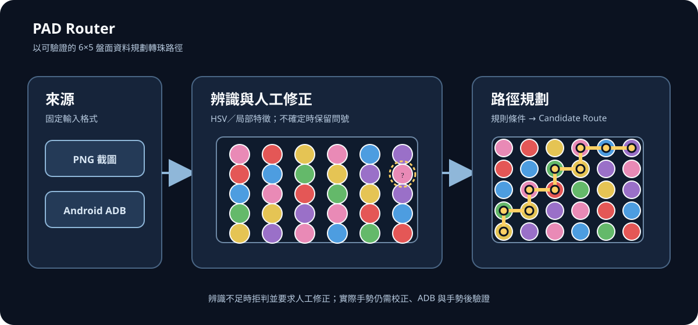

# PAD Router

以 Python 標準函式庫把《龍族拼圖》6×5 標準盤面與 7×6 擴張盤面從截圖整理成可檢查、可規劃的轉珠路徑。

<p align="center">
  
</p>

## 三個核心能力

- **看懂來源**：從 PNG 或 Android ADB 截圖建立 6×5 或 7×6 盤面，並保留可檢查的辨識結果。
- **修正資料**：問號或疑似誤判時可人工修正；相近的後續截圖可使用專案內永久學習資料。
- **規劃並驗證**：依規則評估手動路徑或搜尋 heuristic Candidate Route，通過安全條件後執行並驗證手勢。

## Quick start

需求：Python 3.10 以上與 [`uv`](https://docs.astral.sh/uv/)；桌面入口使用固定版本 `pywebview==5.4` 的 Linux GTK/WebKit backend。Ubuntu 首次使用前安裝：

```bash
sudo apt-get update
sudo apt-get install --yes python3-gi gir1.2-gtk-3.0 gir1.2-webkit2-4.1
uv venv --system-site-packages --allow-existing
uv sync
```

```bash
# 支援的離線桌面 web UI（capture/review/rules/search/execute/operations）
uv run python pad_router.py --gui

# --webview 保留為相容別名
uv run python pad_router.py --webview

# CLI dry run（不送出 ADB）
uv run python pad_router.py --board 111222345634456563123451234563

# 自檢與完整測試
uv run python pad_router.py --self-check
uv run python -m unittest
```

## Desktop web UI

`--gui` starts the delivered offline workspace through pywebview's GTK backend (`gui="gtk"`). The packaged `webview/index.html`, `style.css`, and `app.js` are loaded from the repository-adjacent asset directory; no HTTP server or remote asset is required. The supported desktop smoke sizes are 1100×720, 1366×768, 1440×900, and 1920×1080; status remains in the top bar and the event console retains a visible minimum height.

## 文件

[開啟文件入口](docs/README.md)

## 限制

- 盤面為 6×5 標準盤面或 7×6 擴張盤面（CLI 用 `--board-size`，workspace 用標題列的「盤面」選單切換）；辨識只在校正後來源上工作，訊號不足時會保留 `unknown`，仍需人工修正。
- 搜尋是有限寬度、有限步數的 heuristic，不保證全域最佳；距離勢能只作次級排序。
- 實際手勢需要正確校正、已授權 ADB 裝置與手勢後驗證；按下執行前仍會阻擋不可執行或未確認的路徑。
