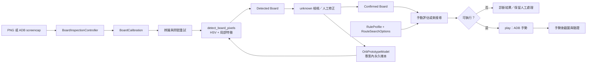

# PAD Router 架構與資料流

這份文件給需要理解責任邊界與安全條件的維護者；使用者操作步驟請看[使用指南](../guides/user-guide.md)，測試與本機資料請看[開發與測試](development.md)。

## 系統邊界

PAD Router 把 6×5 盤面資料流分成兩個入口：

- `pad_router.py`：純 Python 核心，負責盤面規則、Combo／cascade 計算、路徑評估、束搜尋、CLI 與 ADB 手勢驗證。
- `pad_router_gui.py`：Tk GUI 與 `BoardInspectionController`，負責來源檔案／裝置介接、校正、人工修正、規則控制項與顯示；核心規則仍呼叫 `pad_router`。

程式只使用 Python 標準函式庫；Tk 是桌面環境提供的 GUI 模組，ADB 是需要裝置操作時的外部程式。

## 實際資料流

辨識重試會重用同一份 `width`、`height`、原始 `pixels` 與 `Grid`；不會在重試間重新擷取或學習中間的錯誤結果。GUI 顯示來源圖時可縮放，但辨識和校正仍使用原始像素座標。

## 核心模組

### `pad_router.py`

- `Orb`：基本色／危害珠及 `enhanced`、`locked` 等可觀察狀態。
- `Grid`：把 6×5 格子映射到截圖像素座標。
- `detect_board_pixels`／`detect_board`：先判斷危害珠，再用固定 HSV prototype 與局部中心特徵辨識基本色；信心不足回傳 `unknown`。
- `resolve_matches`、`settle`：依橫／縱三連與既有連通規則計算 Match，`cascade` 決定是否繼續處理落下後的 Match。
- `RuleProfile`、`LeaderCondition`、`ConditionGroup`、`ExternalCondition`：描述條件群組、外部條件與危害策略，並可序列化成 JSON。
- `evaluate_manual_route`：驗證路徑並回傳 `RouteEvaluation`，包含 Match rounds、Combo、條件結果、危害結果及 `execution_eligible`。
- `search_qualifying_route`：固定 seed 的隨機嘗試加條件束搜尋；候選先服從既有條件與 shape 優先，再依實際 Combo、步數與路徑穩定排序。一般條件束搜尋的同色珠距離勢能只作次級 tie-break。
- `solve`／`score`：CLI 使用的 Combo 導向束搜尋；`score` 保留 Combo 加上同色珠最近曼哈頓距離懲罰的既有語意。
- `play`：執行 ADB 手勢，並在放手前後進行必要的安全與盤面驗證。

### `pad_router_gui.py`

- `OrbPrototypeModel`：不訓練的 CPU nearest-prototype 學習資料，保存 human／implicit cell feature；正式檔寫在同目錄暫存檔後以 `Path.replace()` 原子替換。
- `BoardInspectionController`：保存 GUI 狀態，串接來源、校正、辨識、問號重試、人工修正、規則、路徑評估與執行。
- `BoardInspectionApp`：Tk widget 與三種清楚的操作模式：Ready 的 route mode、含 `unknown` 時的 review mode、使用者按「修正辨識」後的 correction mode。
- 來源 Canvas 以等比例 display scale 顯示截圖；overlay 與 route overlay 同步縮放，未改變原始 `Screenshot`、`BoardCalibration` 或偵測座標。

## 狀態與安全不變量

1. 盤面含任何 `unknown` 時，不會成為可執行的 Confirmed Board；GUI 保留 review／人工修正入口。
2. 路徑執行需要非空且符合規則的候選、已確認盤面、有效裝置與校正；`play` 保留手勢後盤面驗證。
3. GUI 按下「執行路徑」代表接受目前盤面，會先將目前盤面以低權重 implicit sample 學習；寫入失敗時不送 ADB。
4. Human Annotation 優先於低權重 implicit sample；重新標記同一格的相同 feature 會取代舊樣本。
5. `RuleProfile` 與 `RouteSearchOptions` 互相獨立；規則設定變更會清除舊路徑評估，重試次數不寫入 Rule Profile JSON。

## 不是目前實作的內容

- 搜尋是有限寬度與有限步數的 heuristic search，沒有全域最佳保證。
- 沒有 ML／預訓練模型、怪物資料庫或雲端資料服務。
- 不完整辨識 HP、隊伍、技能、地城狀態或遊戲隨機天降；`cascade` 依核心既有 deterministic 模擬。

進一步的操作與錯誤處理見[使用指南](../guides/user-guide.md)，變更前後檢查見[開發與測試](development.md)。