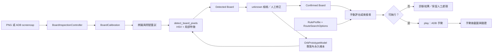

# PAD Router 架構與資料流

這份文件給需要理解責任邊界與安全條件的維護者；使用者操作步驟請看[使用指南](../guides/user-guide.md)，測試與本機資料請看[開發與測試](development.md)。

## 系統邊界

PAD Router 把 6×5 盤面資料流分成核心、控制橋接與一個桌面 web presentation：

- `pad_router.py`：純 Python 核心，負責盤面規則、Combo／cascade 計算、路徑評估、束搜尋、CLI 與 ADB 手勢驗證。
- `pad_router_gui.py`：`BoardInspectionController` 與 `BoardInspectionBridge`；controller 負責來源／辨識，bridge 只暴露序列化 intent 與 snapshot，不載入桌面 widget toolkit。
- `pad_router_webview.py`：`--gui` 啟動固定 GTK backend 的離線 pywebview；`--webview` 是相容別名。`webview/` 只包含本機 HTML、CSS、vanilla JavaScript。

程式核心只使用 Python 標準函式庫；webview presentation 依賴固定版本 `pywebview==5.4` 與 Ubuntu 系統提供的 GTK/WebKit。因 uv project venv 預設隔離 system site-packages，webview setup 必須先安裝 `python3-gi`、GTK/WebKit typelibs，再用 `uv venv --system-site-packages --allow-existing` 建立環境。pywebview 由 repository 相鄰的本機資產載入，不需要 HTTP server 或遠端資產；ADB 是需要裝置操作時的外部程式。

## 實際資料流

辨識重試會重用同一份 `width`、`height`、原始 `pixels` 與 `Grid`；不會在重試間重新擷取或學習中間的錯誤結果。webview 顯示來源圖時可縮放，但辨識和校正仍使用原始像素座標。

## 核心模組

### `pad_router.py`

- `Orb`：基本色／危害珠及 `enhanced`、`locked` 等可觀察狀態。
- `Grid`：把盤面格子映射到截圖像素座標。
- `OrbPrototypeModel`：整包樣本每次存檔都會重寫，因此 `learn(persist=False)` 讓一次擷取的 ROWS×COLS 格只寫一次（7×6、6 MB 樣本庫時是 253 MB → 6 MB 寫入，3.30 → 0.13 秒）。完全相同的樣本不再重複收錄：同一盤面重複擷取只會產生一模一樣的特徵向量，既不會改變最近距離也不會多出標籤，只是讓之後每次預測多掃一輪。實測樣本庫 4272 → 1291 筆（71% 是重複），`detect` 1.00 → 0.36 秒，辨識結果逐格相同。
- `_detect_with_retries`：來源不會變，所以重試只對「答案會變」的 detector 有意義；答案重複就停止。Combo 動畫還在播的盤面每次都讀成 unknown，正是原本會白白付兩次辨識成本的情況。
- `screenshot_band`：`adb exec-out screencap` 一張 1080×2340 畫面是 10.1 MB 未壓縮，WiFi adb 實測 2～83 秒，而 `adb shell` 往返只要 0.11 秒。每個檢查其實只讀一段列（hold 檢查 61 列＝0.26 MB，盤面驗證 992 列＝4.3 MB），因此裁切在裝置端完成，只有該段列過網路；回傳時補零成完整畫面，所有呼叫端的座標運算不變。`board_rows`／`cell_rows` 是各檢查取樣範圍的唯一真值來源。
- `play(screen_size=...)`：帶入畫面尺寸後三次驗證截圖全部改走 band。實測按下執行到珠子開始動 4.4→1.2 秒；連線越差差距越大（資料量差 39 倍，快速連線時受裝置端 screencap 固定成本限制約 4 倍）。
- `infer_calibration` / `_measure_board`：PAD 用黑底框住盤面，因此直接從像素量測盤面邊界——最後一列有內容的位置即底邊，該區帶內亮像素的左右界即側邊，cell = 寬度 ÷ COLS。實機量測（SM-A1560）證實 7×6 盤面**不會**像 6×5 那樣占滿寬度：實際為 left 23、top 1381、cell 147（真值 23–26 / 1381 / 146.5），量測結果 42 格辨識全對。量不到時才退回置中並貼齊底部的推估值。
- `detect_board_pixels`／`detect_board`：先判斷危害珠，再用固定 HSV prototype 與局部中心特徵辨識基本色；信心不足回傳 `unknown`。
- `resolve_matches`、`settle`：依橫／縱三連與既有連通規則計算 Match，`cascade` 決定是否繼續處理落下後的 Match。
- `RuleProfile`、`LeaderCondition`、`ConditionGroup`、`ExternalCondition`：描述條件群組、外部條件與危害策略，並可序列化成 JSON。
- `evaluate_manual_route`：驗證路徑並回傳 `RouteEvaluation`，包含 Match rounds、Combo、條件結果、危害結果及 `execution_eligible`。
- `max_combo_layout`：列舉盤面的 3 格方塊鋪法（6×5 有 22 種，7×6 有 155 種）並指派珠種，回傳本盤面可達的目標版型與其 Combo 數；workspace 顯示結果。
- `set_board_size` / `board_label` / `max_combo_ceiling`：切換 6×5 與 7×6 盤面。盤面大小是模組層級開關，`ROWS`／`COLS` 需以 `pad_router.ROWS` 形式讀取才會跟著切換。
- `_max_combo_route`：專用最大 Combo 束搜尋，節點只算首輪 Match 與剩餘珠三連距離，束寬 `max(30, attempts * 12)`。可用 `path`／`keep` 從既有路徑接續，保留已成立的 Match 格子，讓有條件的搜尋排完形狀後繼續衝 Combo。
- `search_qualifying_route`：固定 seed 的隨機嘗試加條件束搜尋；支援 callback 回報實際 attempts/conditions/max_combo 階段與 cooperative cancellation，取消結果會標記 `RouteSearchResult.cancelled`。最大 Combo 候選先依首輪直接 Combo 與直接最大 Combo 預估排序，不把落珠連鎖列入排名。
- `solve`／`score`：CLI 使用的 Combo 導向束搜尋；`score` 保留 Combo 加上同色珠最近曼哈頓距離懲罰的既有語意。
- `play`：執行 ADB 手勢，並在放手前後進行必要的安全與盤面驗證。

### `pad_router_gui.py`

- `OrbPrototypeModel`：不訓練的 CPU nearest-prototype 學習資料，保存 human／implicit cell feature；正式檔寫在同目錄暫存檔後以 `Path.replace()` 原子替換。
- `BoardInspectionController`：保存 web workspace 狀態，串接來源、校正、辨識、問號重試、人工修正、規則、路徑評估與執行；`snapshot()` 只回傳 JSON-safe status 與一次編碼的 PNG，不暴露 raw pixels。
- `BoardInspectionBridge`：以分離的 interaction/search/execution/operational worker 處理 device、review、rules、search 與 execute intent，保存受控 source/board/planning/execution snapshot 與 persistent console；ADB execution 僅由 execution worker 執行，並回報 acceptance、gesture、verification、stop phases。

### `pad_router_webview.py` 與 `webview/`

- pywebview 僅載入 repository 相鄰的 `index.html`、`style.css` 與 `app.js`；不請求外部網路資產。`--gui` 是支援的桌面入口，`--webview` 保留為相容別名。
- 前端只呼叫 `BoardInspectionBridge.command()` 與 `drain_events()`；`requestAnimationFrame` 合併快速 snapshot，console 從 backend snapshot 重繪，使用者檢視舊記錄時不會被強制捲回尾端。
- workspace 提供裝置清單、選取、截圖、盤面校正、5×6 review、未知／疑似珠子修正、保護格、強化／鎖定標記、規則設定、Profile JSON 匯入／匯出、背景搜尋、取消、診斷／候選預覽、核准、執行與安全停止；執行仍受 Python controller guard。
- 支援的 desktop smoke 尺寸為 1100×720、1366×768、1440×900 與 1920×1080；頂端 status 與底部 event console 保持可見。

## 狀態與安全不變量

1. 盤面含任何 `unknown` 時，不會成為可執行的 Confirmed Board；workspace 保留 review／人工修正入口。
2. 路徑執行需要非空且符合規則的候選、已確認盤面、有效裝置與校正；`play` 保留手勢後盤面驗證。
3. webview 執行前完成 acceptance/learning，執行中拒絕衝突命令，停止要求保留安全放手與手勢後驗證。
4. Human Annotation 優先於低權重 implicit sample；重新標記同一格的相同 feature 會取代舊樣本。
5. `RuleProfile` 與 `RouteSearchOptions` 互相獨立；規則設定變更會清除舊路徑評估，重試次數不寫入 Rule Profile JSON。
6. Bridge 的 board/rule generation 變更會使搜尋 cooperative-cancel；只有仍符合 generation 的結果才可套用，舊結果只會進 console，不會覆寫 current state。
7. Execution command 只接受 current、confirmed、qualifying 且已核准的候選；執行前完成 acceptance/learning，執行中拒絕衝突命令，`play` 保留安全放手與手勢後驗證。

## 不是目前實作的內容

- 搜尋是有限寬度與有限步數的 heuristic search，沒有全域最佳保證。
- 沒有 ML／預訓練模型、怪物資料庫或雲端資料服務。
- 不完整辨識 HP、隊伍、技能、地城狀態或遊戲隨機天降；`cascade` 依核心既有 deterministic 模擬。

進一步的操作與錯誤處理見[使用指南](../guides/user-guide.md)，變更前後檢查見[開發與測試](development.md)。
